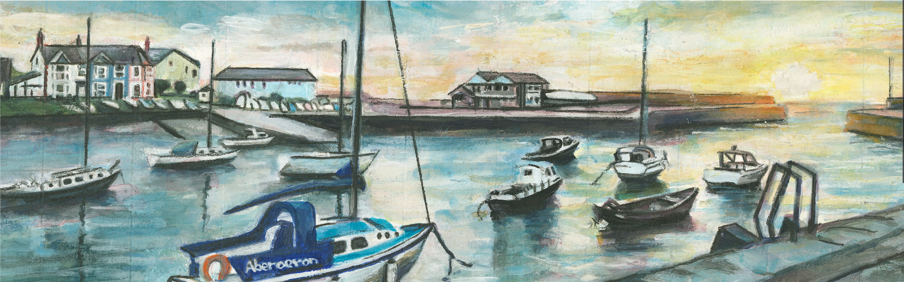
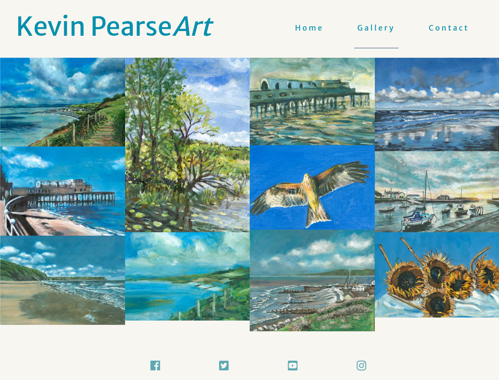
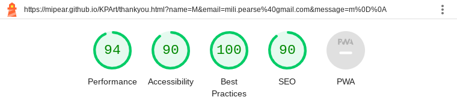

# Kevin Pearse Art

Kevin Pearse Art is a site that hopes to showcase artist Kevin Pearse's work to engage and maximise his audience and customers. This site will be targeted towards fans of art and therefore will prioritise images of the artist's work in a well presented manner. The purpose of the site will be to showcase the art, to give information about the artist and upcoming events, and to allow the user to contact the artist. Kevin Pearse Art will be useful to potential customers of Kevin Pearse as they will be able to contact the seller and know where to find his upcoming events. It will also be useful to the artist Kevin Pearse in order to showcase his work. Due to the site showcasing art, the colour palette is particularly important. For this reason, the colours used on the website have been taken from a painting by the artist himself that will be the hero image. This feature will be beneficial to the artist and the user as it creates a cohesive website, showcasing Kevin Pearse's work through and through.

[Live link](https://mipear.github.io/KPArt/index.html)

## Project Goals:

The primary goal of Kevin Pearse Art is to promote and showcase the artwork of artist Kevin Pearse in a clear and aesthetically pleasing way. The website should include the artist’s work, information about the artist, a way for the user to contact the artist, and any future events the artist’s work is featured at. The target audience, and therefore the targeted external user, for this site will be people who like and engage with art and artists.

### External user goals:

External user goals are:

1. To see the artwork and be able to navigate the website in a clear way.
2. To learn a little about the artist.
3. To have the ability to easily contact the artist should they have any queries.
4. To know about any upcoming events that features the artist’s work.
5. To have access to the artist’s relevant social media.

### Kevin Pearse Art seeks to meet these needs by:

1. Ensuring the site is easy and clear to navigate, prioritising visualising the art as showcasing the art is the ultimate purpose of the site.
2. Having a section for the artist to say a little about himself in his own words and include an image of the artist alongside this. By including this section on the Home page, the user will gain context about the artist and his art before seeing the extent of the art on the subsequent Gallery page.
3. Including a Contact page wherein the external user is able to easily send a message to the artist. After filling in their name and email, the user will be able to send a message and be taken to a Thank You page to ensure they know the artist has received said message.
4. Informing the external user of any upcoming events featuring the artist’s work. This will include titles of said events and their locations.
5. Implementing social media links within the Footer of the site, represented by their relevant icons. When clicked, the links will open into a separate tab, to ensure a good user experience. This will allow the user to access the artist’s social media efficiently without having to leave the page and without the page appearing to be cluttered.

### Site owner/Artist’s goals:

The site owner is the artist, Kevin Pearse. His goals are:

1. To showcase and publicise his artwork in a clear way.
2. To introduce himself to existing and future potential customers/supporters.
3. To further network within the artists’ community.
4. To be able to receive messages from potential customers/supporters.
5. To publicise and inform of any future exhibitions.
6. For any social media to be easily accessible, to further promote his work.

### Kevin Pearse Art seeks to meet these needs by:

1. Prioritising the images of the artwork above all else, including at least one image of the artwork on each page. The pages themselves will be easy to navigate and will be clear in design to ensure the focus is primarily on the paintings.
2. Including a section where the artist is able to introduce himself (in his own words) alongside an image of himself. Kevin Pearse will be able to contextualise the artwork and ensure a more personal feel to the site through doing this.
3. Presenting a body of work that reflects the style of the artist. This allows other artists to see and understand a little about the art and artist, and further establish Kevin Pearse within the art world.
4. Implementing a contact page wherein the artist is able to receive messages from potential customers/supporters. When filled in, the artist will be sent the user’s name, email, and message, and therefore can use the email to respond to the user, extending communication with his audience.
5. Informing the external user of any upcoming events featuring the artist’s work. This will include titles of said events and their locations. By presenting this information in a clear and specific way, the user is more likely to attend an exhibition.
6. Including social media links within the Footer of the site, represented by their relevant icons. When clicked, the links will open into a separate tab, to ensure a good user experience. By including these links within the Footer, potential supporters/customers are able to access the artist’s social media on every page of the website, increasing the likelihood of engagement from the external user.

## Wireframes

Please find wireframes below, created using [Balsamiq](https://balsamiq.com/wireframes/desktop/#). Included in my wireframes are a desktop, tablet, and mobile version of each page. The Home Page and Contact Page will function in a similar way across devices, whilst the Gallery images will be one column instead of four on mobile devices in order to ensure the user can see the images/paintings clearly.
Here are the [wireframes](docs/readmewireframes).

## Features

### Existing Features

- __Navigation Bar__

  - Featured on all three pages, the full responsive navigation bar includes links to the Logo, Home page, Gallery and Contact page and is identical in each page to allow for easy navigation.
  - This section will allow the user to easily navigate from page to page across all devices without having to revert back to the previous page via the ‘back’ button.
  - On smaller screens (e.g. mobile) the Navigation Menu will be replaced by a hamburger menu that includes the three main pages included in the menu. This deviation from my wireframe was implemented as on smaller screens, the navigation bar appeared too bulky, when the emphasis should be on the contents and images of the site.

- __The hero image__

  - The hero image includes a photograph of a painting by artist Kevin Pearse. It does not include text overlay as the artist felt this would take the user away from admiring the artist's work, which is the goal of the image. The painting itself has the place name "Aberaeron" visible on a boat, giving context to the user of the places and scenes the artist features in his work.
  - The colour palette for the website has been used using this hero image, creating a cohesive experience for the user.

- __About Me section__

  - The About Me section allows the user to know a little about the artist. The About Me section is written by the artist in order to create a more personal feel to the website. Alongside the artist's words is an image of the artist. 
  - By including the About Me section on the home page, the artist is able to introduce himself in a more personal way and give context to his paintings before users and therefore potential customers and supporters delve into his art on the subsequent page of the Gallery.

- __Upcoming events section__

  - This section will allow the user to know when and where the artist will feature his work. It is beneficial for the artist to promote these events in order to sell his art.
  - Underneath the address' for the events are maps of said events. This allows the user to find the address' with ease and therefore is more likely to entice the user to the event. The maps have been included, despite not being in the wireframes, as it is an accessible way for the user to quickly know more about the event.
  - This section will be updated as more events take place to keep the user up to date.

- __The Footer__

  - The footer section includes links to the relevant social media sites for Kevin Pearse. The links will open to a new tab to allow easy navigation for the user.
  - The footer is valuable to the user as it encourages them to keep connected via social media and continue raising the artists' profile.

- __Gallery__

  - The gallery will provide the user with images of the artists' paintings to showcase the artists' work and gain support.
  - This section is valuable to the user as they will be able to browse the paintings clearly before potentially visiting and event of the artist or contacting the artist via the Contact page. This section is highly valuable to the artist as this showcases his work to potential customers and supporters.
  - On mobile screens, the gallery changes from being four columns to one column in order to ensure that the user can inspect and enjoy the images with ease. The purpose of the website is to showcase the artist's paintings, and therefore, it is of the upmost importance that the images are easy to see.
  - Should and image not load, alternative text is included with each image to ensure the user knows the kind of paintings the artist creates.

- __The Contact Image__

   - This section includes an image of a painting from the artist. Due to the website being to promote and showcase the artists' work, an image of the art is valuable on each page to entice the user to becoming buyers and/or supporters.
   - The image featuring lots of blue ties in with the colour palette used on the rest of the website.

- __The Contact Section__

  - This page will allow the user to contact the artist directly. The user will be instructed to write their name, email, and send a message of their choosing to the artist. This section is purposefully not too specific in its instructions as the messages from potential users could be in regards to ordering potentially through contacting the artist himself or in order to gain more information about the upcoming events.

- __The Thank You Page__

  - Once the user has inputted and submitted their information of The Contact Page, the user will be directed to another page within the website, The Thank You Page. This allows the user to know that they have sent their message to the artist while also allowing the artist to thank the user for their message.
  

## Colours

Due to the purpose of Kevin Pearse Art being to showcase and promote the artist's work, colour has been particularly paid attention to. It was important to the artist that the presentation of colours was simplistic in order to emphasise the artwork itself. At the same time, it was significant for the colours to feel cohesive to the artist's work. To meet these needs, the website has used a palette of colours only from the hero image of the page. This was done using the website [Coolors.co's](https://coolors.co/image-picker) feature as seen below:

As so much of Kevin Pearse's artwork featuring nature and, more specifically, the sea, two shades of blue - #0590AEff and #2A4D76ff - and one shade of grey - #6C8989ff - has been used within the text. This use of colour encourages the user's association between the website and nature, nature and art, and is representative of the artist who says in the About Me that he paints plein air. The off-white colour - #F8F6F0ff - is the lightest part of the hero image and is used as a background colour for the entire site. This simplicity was of importance to this site as the attention should remain on the art itself, without distractions. Overall, the palette emphasises the integrity of the website in promoting the artist and his art through creating a cohesive space that is easy to navigate and is representative of the artist.

## Features Left to Implement

- A feature I would like to implement would be a shop page, represented by a trolley icon in the navigation menu, in order to purchase any paintings directly from the website itself rather than contacting the seller.

## Testing

Kevin Pearse Art has been  tested  across all pages manually on desktop, tablet, and mobile phone. In order to gauge a more reliable judgement of responsiveness, I have continuously used Chrome’s [Dev Tools](https://developer.chrome.com/docs/devtools/) feature. All of the following features have been tested both manually and using Dev Tools.

### External user goal: *1. To see the artwork and be able to navigate the website in a clear way.*

### Artist goal: *1. To showcase and publicise his artwork in a clear way.*

*- The Navigation Menu:* The navigation menu is clearly labelled making it easy for the external user to navigate the website. The hamburger menu on smaller screens allows responsiveness and ensures the focus is on the images and content of the website. These features meet the needs of the users to “navigate the website in a clear way” and the artist’s goals to “showcase and publicise his artwork in a clear way”.

Here is the Navigation Menu on desktop screens:

Tablet screens:

Mobile screens:

*- The Hero Image:* The Hero Image remains at the top of the Home Page, beneath the Navigation Menu. I did, however, come across an issue when testing the Home Page on mobile screens. The image would leave a slight gap on the right of the screen, despite its width being set to 100%. This was resolved by creating a html tag within the css of overflow:none. The Hero Image is now responsive on all screens and immediately fulfills the external user and the artist's goals of "To see the artwork" and "To showcase and publicise his artwork" respectively. It immediately allows the user to see the artist's work before stepping into any other aspect of the website. There is also a zoom effect on the image itself, causing the user to take a moment to really look at the image.

*- The Gallery:* In order to prioritise resposivity and showcasing the art, the desktop version of the Gallery includes four columns, the tablet screen has two columns, and the mobile/smaller screen only shows one column. While testing this both manually on different devices, and through Dev Tools, this was the most efficient and accessible way of viewing the images clearly as a user. This meets the goals of both user and artist of "To see the artwork" and "To showcase and publicise his artwork" respectively.

Desktop Gallery with four columns:

Tablet Gallery with two columns:

Mobile Gallery with one column:

__External user goal:__ *2. To learn a little about the artist.*

__Artist goal:__ *2. To introduce himself to existing and future potential customers/supporters and 3. To further network within the artists’ community.*

*- The About Section* is responsive across all different screen sizes. It not only fulfills the goals of the user of knowing a little about the artist but also allows the artist to introduce himself in his own words, allowing the website to feel personal and representative of the artist. The About Me section offers context to the rest of the website too, as it explains that the artist works plein-air. This further creates cohesion to the website, which has a real emphasis on nature due to this being the artist's focus. This section not only introduces Kevin Pearse to a wider audience of potential customers/supporters, but also to other artists. Immediately, artists and supporters alike as users are able to get to know the artist and see his artwork.

- The platform itself is a form of further networking within the artis' community as the artist is now able to share the site immediately at exhibitions or online, and users are then able to know more about, contact, and eventually support the artist through the site.

__External user goal:__ *3. To have the ability to easily contact the artist should they have any queries.*

__Artist goal:__ *4. To be able to receive messages from potential customers/supporters.*

*- The Contact and Thank You page:* Across devices, the Contact Page and the Thank You Page is easy to navigate and meets the user and artist's goals of "To have the ability to easily contact the artist" and "To be able to receive messages from potential customers/supporters" repsectively. Users are able to type in their name, email, and send a message to the artist. The Thank You page allows a further touch of personalisation for the site by allowing the artist to thank the user for the message, ensuring the site is centered around the artist and allowing the artist to create a relationship witht the users.
The Contact Page: 

Thank You Page: 

__External user goal:__ *4. To know about any upcoming events that features the artist’s work.*

__Artist goal:__ *5. To publicise and inform of any future exhibitions.*

*- Upooming Events:* Despite creating a media query for smaller screens for the Upooming Events section, some tablets presented the maps overlapping. This was fixed through further media queries. The Upcoming Events meet the needs of the user by informing the external user of "any upcoming events featuring the artist’s work". It also meets the goals of the artist whose goal was to "publicise and inform of any future exhibitions". The addresses and maps, which allows potential customers/supporters to visit ehe artist's exhibition, sits side by side on desktop screen but sit one below each other on tablet and mobile screens to ensure the user can see the locations clearly.

Desktop version of Upcoming Events includes the maps side by side:

Tablet and mobile version includes one map below the other to ensure user is able to navigate the website with ease:

__External user goal:__ *5. To have access to the artist’s relevant social media.*

__Artist goal:__ *6. For any social media to be easily accessible, to further promote his work.*

*- The Footer:* Across all pages and screens, the footer sits at the bottom of the website, allowing users to always have access to the artist’s social media should they wish to extend their support. This meets the needs of both external user and artist, allowing social media to be easily accessible and, therefore, hopefully enticing the user to further their support through following.

I used [Google Lighthouse](https://chrome.google.com/webstore/detail/lighthouse/blipmdconlkpinefehnmjammfjpmpbjk) to test the performance of the site:

- Home Page: 

- Contact Page: 

- Thank You Page: 

- Gallery Page: Initially, the Gallery Page showed a performance level of merely 20%. To resolve this issue, all images have been compressed, I've ensured all images are .webp files, and all images have been resized to ensure the files are smaller. 

### Validator Testing

### HTML

Initially, nine errors were found across the four pages - including thankyou.html - which primarily were errors within the head and the footer. The errors found were as follows:

- "Info: Trailing slash on void elements has no effect and interacts badly with unquoted attribute values". This was resolved by simply deleting the unecessary trailing slash.
- "Warning: Section lacks heading". This has been resolved by changing the section to a div, as no heading is necessary.
- "Error: Unclosed element a". This error caused multiple other errors and was resolved by closing the a tag.
- The final error present was to include a lang within the head.
Once these errors were resolved, no errors were returned on any page of the site when using the official [W3C validator](https://validator.w3.org/nu/?doc=https%3A%2F%2Fmipear.github.io%2FKPArt%2Findex.html) both through url and inputting text.

### CSS

No errors were found when passing through the official [(Jigsaw) validator](https://jigsaw.w3.org/css-validator/validator?uri=https%3A%2F%2Fmipear.github.io%2FKPArt%2Findex.html&profile=css3svg&usermedium=all&warning=1&vextwarning=&lang=en) both through url and inputting text.

### Unfixed Bugs

While creating this project I ran into an issue with Code Anywhere in which it was no longer allowing me to push, after suddenly going offline when commiting my work. There was an issue with the branches. Following this, the browser displayed the footer and images as though they had not been styled. When I checked the css and html, everything was normal, but the footer and images remained unstyled. I contacted Tutor Assistance in regards to this issue who suggested creating a new repository and to put my code into there. There have been no known unsolved issues within this workspace.

## Deployment

- The site was deployed to GitHub pages. The steps to deploy are as follows:
  - In the GitHub repository, navigate to the Settings tab
  - From the Code and automation dropdown menu, select Pages
  - Ensure the Source within Build and deployment says to Deploy from a branch
  - Change the Branch to main and save
  - Your site should now be live and the link should appear at the top of the page
  - If you wish, you can create a custom domain for your link using the Custom Domain section below Build and deployment. Simply write in your domain and save

The live link can be found here - <https://mipear.github.io/KPArt/index.html>

## Credits

- Part of this project was done following along to the Code Institute tutorials, nameley, the Love Running Project and the Resume Mini Project.
- This website was partly inspired by artists' websites the artist, Kevin Pearse, enjoyed such as [Lynne Cartlidge](https://www.lynnecartlidge.com/) and [Peter Brown](https://www.peterbrownneac.com/).
- A huge thank you to Martina, my mentor, for her constant support, efficiency, and helpful suggestions.

### Content

- The icons in the footer were taken from [Font Awesome](https://fontawesome.com/)
- I used [Google Maps](https://www.google.com/maps) to create the maps in the Upcoming Events section.
- To compress the images, I used [tinypng.com](https://tinypng.com/)
- In order to create a palette of colours, I used [Coolors.co](https://coolors.co/image-picker) and created my palette via the artist's hero image painting.
- I used [Bootstrap](https://getbootstrap.com/docs/4.3/getting-started/introduction/) for the Contact Form, Navigation menu, and Upcoming Events.
- To write my code, I used [Code Anywhere](https://app.codeanywhere.com/)
- I used [GitHub](https://github.com/) for version control and to deploy through [Github Pages](https://pages.github.com/)
- For testing purposes, I used [Google Lighthouse](https://chrome.google.com/webstore/detail/lighthouse/blipmdconlkpinefehnmjammfjpmpbjk), [Dev Tools](https://developer.chrome.com/docs/devtools/), and validators [(Jigsaw) validator](https://jigsaw.w3.org/css-validator/validator?uri=https%3A%2F%2Fmipear.github.io%2FKPArt%2Findex.html&profile=css3svg&usermedium=all&warning=1&vextwarning=&lang=en) and [W3C validator](https://validator.w3.org/nu/?doc=https%3A%2F%2Fmipear.github.io%2FKPArt%2Findex.html).
- To create the mockup and test the website's responsiveness, I used [Am I Responsive?](https://ui.dev/amiresponsive)
- For the text, I used 'Merriweather Sans' from [Google  Fonts](https://fonts.google.com/)
- The [Love Running README](https://github.com/lucyrush/readme-love-running) was useful in knowing how to create a READ ME
- Alongside this, this [Markdown Cheat Sheet](https://www.markdownguide.org/cheat-sheet/) has been useful in understanding how to write in Markdown syntax.
- This [Media Queries](https://www.freecodecamp.org/news/css-media-queries-breakpoints-media-types-standard-resolutions-and-more/) article was incredibly useful in understanding breakpoints and responsiveness.
- I used the following Social Media platforms for the footer - [Facebook](https://www.facebook.com/), [Instagram](https://www.instagram.com/), [Youtube](https://www.youtube.com/), and [Twitter](https://twitter.com/).

### Media

- The images used across all pages of the website are owned by Kevin Pearse, the artist this website showcases.
- The wireframes within the README.md were created using [Balsamiq] (<https://balsamiq.com/wireframes/desktop/#>)